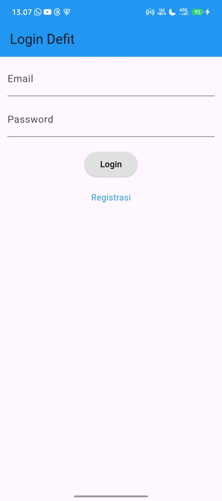
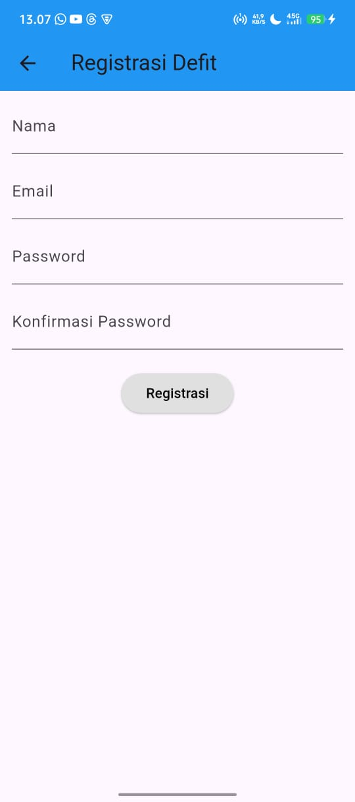
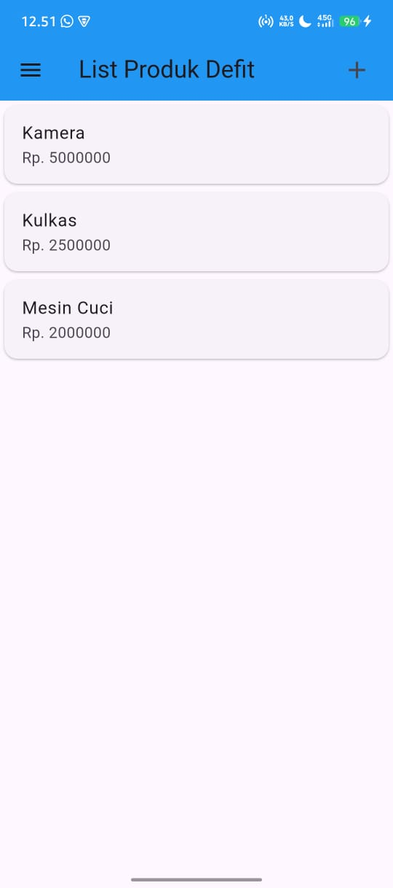
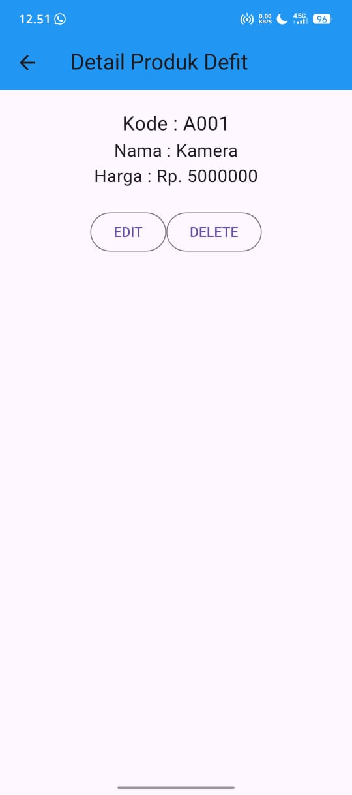

### *Praktikum Pemrograman Mobile — CRUD Produk Flutter + CodeIgniter 4*

---

# 📘 **TUGAS 8 — Praktikum Pemrograman Mobile**

## **Aplikasi CRUD Produk dengan Flutter**

Aplikasi ini merupakan tugas pertemuan ke-10 yang mengimplementasikan **CRUD Produk** menggunakan Flutter sebagai frontend dan CodeIgniter 4 (REST API) sebagai backend.
UI pada aplikasi ini dibuat sesuai modul, dan semua **Action Bar** telah disesuaikan dengan nama panggilan:

👉 **Defit** (contoh: *List Produk Defit*, *Tambah Produk Defit*, *Detail Produk Defit*)

---

# 👤 **Identitas Mahasiswa**

| Keterangan        | Data                            |
| ----------------- | ------------------------------- |
| **Nama**          | Defit Bagus Saputra             |
| **NIM**           | H1D023036                       |
| **Kelas / Shift** | Shift C (Awal) / Shift F (Baru) |
| **Mata Kuliah**   | Praktikum Pemrograman Mobile    |

---

# 📱 **Deskripsi Aplikasi**

Aplikasi ini dapat melakukan:

✔ Registrasi
✔ Login
✔ Menampilkan daftar produk
✔ Menambah produk
✔ Mengedit produk
✔ Menghapus produk
✔ Melihat detail produk

Semua proses **CRUD** dilakukan melalui UI Flutter, yang nantinya dihubungkan ke REST API CodeIgniter 4.

---

# 🧩 **Struktur Folder (Flutter)**

```
lib/
 ├── main.dart
 ├── model/
 │    └── produk.dart
      └── login.dart
      └── registrasi.dart
 └── ui/
      ├── login_page.dart
      ├── registrasi_page.dart
      ├── produk_page.dart
      ├── produk_form.dart
      └── produk_detail.dart
```

---

# 🖼️ **Screenshots**

| Halaman       | Screenshot                                 |
| ------------- | ------------------------------------------ |
| Login         |            |
| Registrasi    |  |
| List Produk   |       |
| Tambah Produk |   |
| Detail Produk |   |

> Semua file screenshot disimpan dalam folder:
> 📂 **/screenshots/**

---

# 🧠 **Penjelasan Kode & Logika**

Berikut penjelasan setiap halaman:

---

## 1️⃣ **Model Produk – `produk.dart`**

Model ini digunakan sebagai struktur data untuk objek produk:

```dart
class Produk {
  String? id;
  String? kodeProduk;
  String? namaProduk;
  var hargaProduk;

  Produk({this.id, this.kodeProduk, this.namaProduk, this.hargaProduk});

  factory Produk.fromJson(Map<String, dynamic> obj) {
    return Produk(
      id: obj['id'],
      kodeProduk: obj['kode_produk'],
      namaProduk: obj['nama_produk'],
      hargaProduk: obj['harga'],
    );
  }
}
```

Digunakan pada list, detail, edit, dan tambah produk.

---

## 2️⃣ **Halaman Login — `login_page.dart`**

Fungsi:

* Input email & password
* Validasi form
* Tombol "Login"
* Arahkan ke halaman registrasi

Action Bar: **Login Defit**

Potongan kode:

```dart
AppBar(
  backgroundColor: Colors.blue,
  title: const Text("Login Defit"),
)
```

---

## 3️⃣ **Halaman Registrasi — `registrasi_page.dart`**

Fungsi:

* Input nama, email, password, dan konfirmasi password
* Validasi input
* Tombol registrasi

Action Bar: **Registrasi Defit**

```dart
AppBar(
  backgroundColor: Colors.blue,
  title: const Text("Registrasi Defit"),
)
```

---

## 4️⃣ **List Produk — `produk_page.dart`**

Fungsi:

* Menampilkan daftar produk
* Tombol tambah produk (+)
* Menu drawer (Logout)
* Klik item membuka detail produk

Action Bar: **List Produk Defit**

```dart
AppBar(
  title: const Text("List Produk Defit"),
  backgroundColor: Colors.blue,
)
```

Tampilan dibuat dengan ListView + Card.

---

## 5️⃣ **Tambah / Edit Produk — `produk_form.dart`**

Fungsi:

* Menambah produk baru
* Mengubah produk (jika ada argumen produk)
* Menggunakan satu halaman untuk dua mode

Jika update → Form otomatis terisi.

Action Bar:

* Tambah Produk Defit
* Ubah Produk Defit

Kode otomatis menentukan judul halaman:

```dart
judul = "UBAH PRODUK Defit";
tombolSubmit = "UBAH";
```

---

## 6️⃣ **Detail Produk — `produk_detail.dart`**

Fungsi:

* Menampilkan data produk (kode, nama, harga)
* Tombol Edit
* Tombol Delete

Action Bar: **Detail Produk Defit**

---

# 🚀 **Cara Menjalankan Aplikasi**

1️⃣ Jalankan perintah:

```
flutter pub get
```

2️⃣ Jalankan aplikasi:

```
flutter run
```

3️⃣ Aplikasi akan dimulai pada halaman **Login Defit**.

---

# 📌 **Catatan**

* Backend/API belum terhubung (data masih statis).

---
